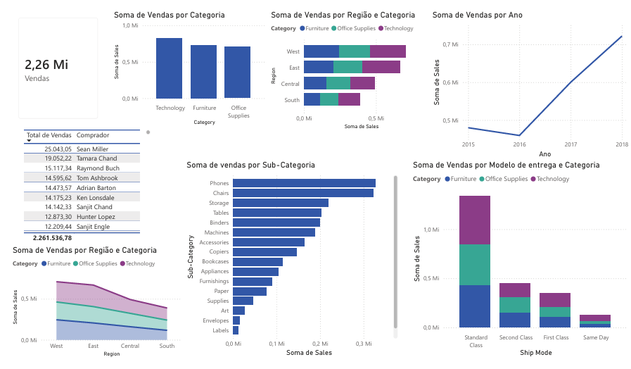

# Análise de Vendas — Superstore Sales

Projeto de análise e visualização de dados utilizando SQL para exploração e Power BI para o dashboard final, com um dataset público do Kaggle contendo dados de vendas de uma empresa de varejo americana.

---

## Dataset

- **Fonte:** Kaggle — Superstore Sales Dataset
- **Período:** 2015 a 2018
- **Campos principais:** Order Date, Category, Sub-Category, Region, Ship Mode, Customer Name, Sales

---

## Visão Geral

O dataset contém 9.800 pedidos com faturamento total de **2,26 milhões** distribuídos em três categorias:

| Categoria | Faturamento | Quantidade de Pedidos |
|---|---|---|
| Technology | 827.455 | 1.813 |
| Furniture | 728.658 | 2.078 |
| Office Supplies | 705.422 | 5.909 |

Office Supplies tem o maior volume de pedidos mas o menor faturamento — são produtos baratos comprados com frequência. Tecnologia tem o menor volume mas o maior faturamento — produtos de alto valor comprados pontualmente.

---

## Perguntas e Insights

---

### 1. Quais regiões mais compram e existe preferência por categoria?

West e East dominam o faturamento. Nenhuma das três categorias dispara com muita força em nenhuma região específica, mas Tecnologia tem aumentado proporcionalmente ao longo do tempo em todas elas — indicando uma tendência de crescimento dessa categoria independente da região.

---

### 2. Existe tendência no método de entrega?

Independente da categoria, região ou valor do produto, a grande maioria dos clientes escolhe **Standard Class** — o método mais barato e mais lento. Mesmo em compras de alto valor como equipamentos de tecnologia, o cliente prefere pagar menos no frete e esperar mais. O padrão é consistente em todas as categorias sem exceção.

---

### 3. Quais subcategorias são as mais vendidas?

As subcategorias com maior faturamento são **Phones, Chairs, Tables e Machines**. Um dado interessante: Copiers aparece com faturamento relevante apesar de ter apenas 66 unidades vendidas — ticket médio altíssimo, provavelmente equipamentos corporativos. No outro extremo, Fasteners tem 214 vendas mas faturamento irrisório — confirma o padrão de Office Supplies de alto volume e baixo valor unitário.

---

### 4. Evolução do faturamento por ano

| Ano | Faturamento |
|---|---|
| 2015 | 479.856 |
| 2016 | 459.436 |
| 2017 | 600.192 |
| 2018 | 722.052 |

Houve uma queda em 2016 seguida de recuperação forte — o faturamento quase dobrou de 2015 para 2018. A tendência geral é de crescimento consistente ao longo do período.

---

### 5. Quais clientes concentram mais vendas?

Não existe um cliente dominante que represente risco para o negócio — a base é distribuída, o que é saudável. Os maiores compradores são **Sean Miller** com 25 mil em vendas e **Tamara Chand** com 19 mil. Ambos concentram suas compras principalmente em Tecnologia, confirmando o padrão de que os clientes de maior valor são compradores de produtos caros e pontuais.

---

## Dashboard

---

## Ferramentas utilizadas

- DB Browser for SQLite — exploração e análise com SQL
- Power BI Desktop — visualização e dashboard
- Dataset público do Kaggle — Superstore Sales
