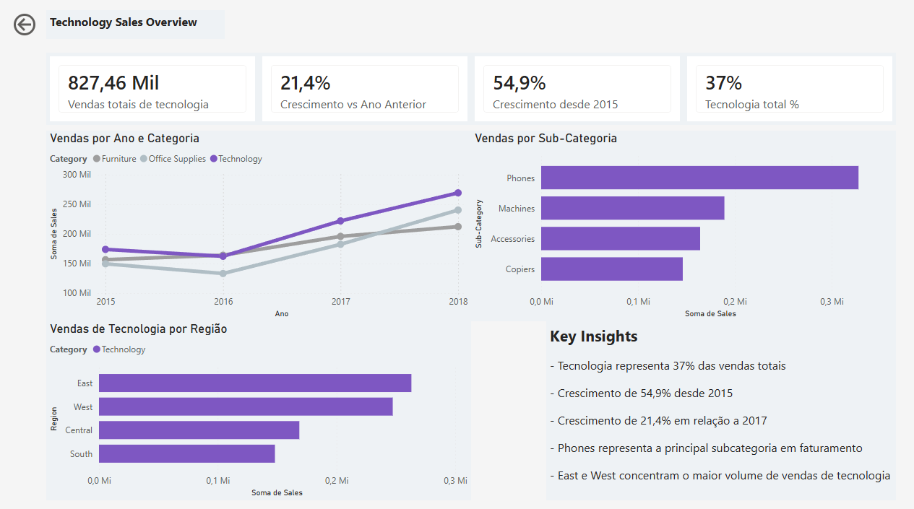

# Superstore Sales Analysis

Projeto de análise de dados utilizando **SQL** para exploração e **Power BI** para construção de dashboards executivos, baseado em um dataset público de vendas do varejo americano.

O objetivo foi transformar dados brutos em informações úteis para apoiar decisões de negócio, utilizando boas práticas de exploração, modelagem e comunicação de dados.

---

# Objetivo

Investigar padrões de vendas, comportamento dos clientes e evolução do faturamento da empresa, respondendo perguntas de negócio através de consultas SQL e dashboards desenvolvidos no Power BI.

Durante o projeto também foram aplicados conceitos de **Storytelling with Data**, priorizando a comunicação clara dos principais insights em vez da simples exibição de gráficos.

---

# Dataset

- **Fonte:** Kaggle — Superstore Sales Dataset
- **Período:** 2015 a 2018
- **Registros:** 9.800 pedidos
- **Campos principais:**
  - Order Date
  - Customer Name
  - Category
  - Sub-Category
  - Region
  - Ship Mode
  - Sales

---

# Processo

O projeto foi desenvolvido nas seguintes etapas:

1. Exploração dos dados utilizando SQL.
2. Identificação de padrões e oportunidades de análise.
3. Construção de métricas e indicadores.
4. Modelagem dos dados no Power BI.
5. Desenvolvimento dos dashboards.
6. Refinamento da apresentação utilizando conceitos de Storytelling with Data.

---

# Visão Geral do Dataset

O faturamento total foi de aproximadamente **2,26 milhões**, distribuído entre três categorias:

| Categoria | Faturamento | Pedidos |
|-----------|------------:|---------:|
| Technology | 827.455 | 1.813 |
| Furniture | 728.658 | 2.078 |
| Office Supplies | 705.422 | 5.909 |

### Insight

Embora **Office Supplies** possua o maior número de pedidos, seu faturamento é o menor, indicando produtos de baixo valor unitário.

Já **Technology** apresenta o menor volume de pedidos, mas o maior faturamento, evidenciando produtos de maior valor agregado.

---

# Perguntas de Negócio Respondidas

## 1. Quais regiões mais compram e existe preferência por categoria?

As regiões **West** e **East** concentram o maior faturamento da empresa.

Apesar de não existir uma categoria dominante em uma região específica, a categoria **Technology** apresentou crescimento consistente ao longo do período em todas elas.

---

## 2. Existe tendência no método de entrega?

Independentemente da categoria, região ou valor do produto, o método **Standard Class** é amplamente dominante.

Mesmo para compras de maior valor, os clientes demonstram preferência pelo menor custo de frete em vez da entrega mais rápida.

---

## 3. Quais subcategorias geram maior faturamento?

As principais subcategorias são:

- Phones
- Chairs
- Tables
- Machines

Um comportamento interessante observado:

- **Copiers** possui baixo volume de vendas, porém ticket médio extremamente elevado.
- **Fasteners** possui alto volume de vendas, mas faturamento muito reduzido.

Esse contraste evidencia diferentes estratégias de comercialização entre categorias.

---

## 4. Como o faturamento evoluiu ao longo do tempo?

| Ano | Faturamento |
|-----:|------------:|
| 2015 | 479.856 |
| 2016 | 459.436 |
| 2017 | 600.192 |
| 2018 | 722.052 |

Após uma pequena queda em 2016, a empresa apresentou crescimento contínuo, encerrando 2018 com aproximadamente **50% mais faturamento** em relação ao início da série histórica.

---

## 5. Existe concentração de faturamento em poucos clientes?

Não.

A base de clientes é relativamente distribuída, reduzindo a dependência de compradores específicos.

Os maiores compradores identificados foram:

- Sean Miller
- Tamara Chand

Ambos apresentam maior concentração de compras na categoria **Technology**, reforçando o perfil de clientes de alto ticket.

---

# Dashboard Geral

O dashboard apresenta uma visão ampla das vendas da empresa, permitindo analisar categorias, regiões, subcategorias, clientes e evolução temporal.

---

# Dashboard Executivo — Technology

Este dashboard foi desenvolvido para comunicar rapidamente os principais indicadores da categoria **Technology**.

### Principais Insights

- Technology representa **37%** do faturamento total.
- Crescimento de **54,9%** desde 2015.
- Crescimento de **21,4%** em relação ao ano anterior.
- **Phones** é a subcategoria com maior faturamento.
- **East** e **West** concentram o maior volume de vendas da categoria.

---

# Ferramentas Utilizadas

- SQL (SQLite)
- DB Browser for SQLite
- Power BI Desktop
- DAX
- Kaggle Dataset

---

# Principais Aprendizados

Durante este projeto pratiquei:

- Exploração e análise de dados utilizando SQL.
- Modelagem de dados no Power BI.
- Criação de medidas utilizando DAX.
- Construção de dashboards executivos.
- Comunicação de insights utilizando princípios de Storytelling with Data.
- Organização de análises com foco em tomada de decisão.

---
